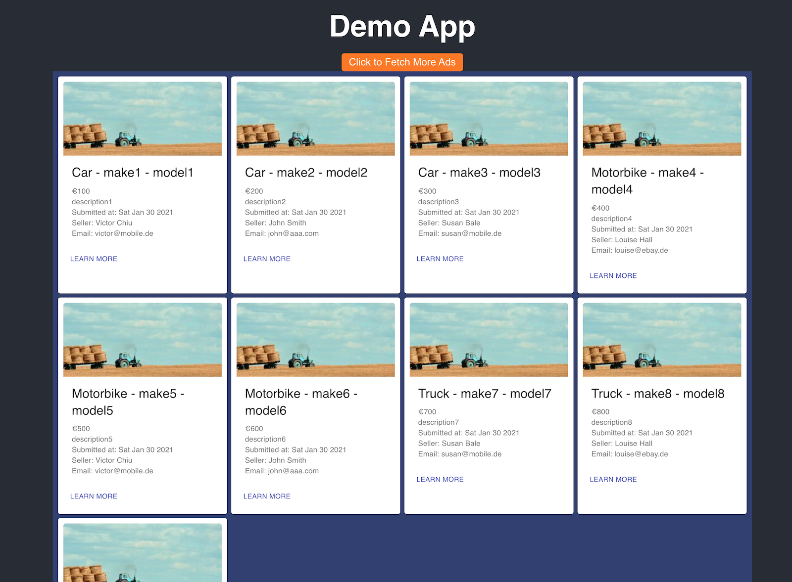

Mobile DE - Demo App
====================

This project implements a very simple API that manages customers and their ads as part of the coding challenge.

### Base Stack
 - Java 11
 - SpringBoot 2.4.2
 - Maven 3.6
 - Kotlin 1.3 (for SpringBoot tests)
 - MySQL 5.7
 - React JS 
 - Docker, docker-compose

### API Functionality
 - Creates, deletes, lists `MobileAd` and `MobileCustomer` into MySQL
 - Validates the required fields in each entity upon creation
 - Implements and validates the relationship between ad and customer in DB and application layer
 
### Structure 
- The project consists of a Springboot app found in `demo-app-server`
- A React app found in `demo-app-client` that talks to the API and lists the ads
- Springboot, React, and MySQL can be all started together with `docker-compose`
- Controller and Service tests were done in Kotlin

### Easiest and best way of running all services is `run.sh` in the project's root folder
```shell script
./run.sh
```
1. This script will run `mvn package` to build the executable jar and run `docker-compose up`
2. Docker-compose will bring up the MySQL container and create the necessary database
3. Start the Springboot app, run necessary migrations with `Flyway`
4. Start the React app at `localhost`
5. Start the Springboot app at `localhost:8080`
6. You should see: 
7. Docker compose mounts a volume in the host's machine and logs are logged into `demo-server-app/logs/demo-app.log` with logging configuration set up in `logback-spring.xml`
8. The ad pictures are just random images fetched from `https://picsum.photos`

 
### Running tests
Inside `demo-app-server` folder, run:
```shell script
mvn test
```
### Test output:
```shell script
[INFO] Tests run: 5, Failures: 0, Errors: 0, Skipped: 0, Time elapsed: 0.516 s - in de.mobile.controller.CustomerResourceTest
[INFO] Running de.mobile.service.CustomerServiceTest
[INFO] Tests run: 6, Failures: 0, Errors: 0, Skipped: 0, Time elapsed: 0.079 s - in de.mobile.service.CustomerServiceTest
[INFO] Running de.mobile.service.AdServiceTest
[INFO] Tests run: 6, Failures: 0, Errors: 0, Skipped: 0, Time elapsed: 0.041 s - in de.mobile.service.AdServiceTest
[INFO]
[INFO] Results:
[INFO]
[INFO] Tests run: 21, Failures: 0, Errors: 0, Skipped: 0
[INFO]
[INFO] ------------------------------------------------------------------------
[INFO] BUILD SUCCESS
[INFO] ------------------------------------------------------------------------
[INFO] Total time:  6.411 s
[INFO] ------------------------------------------------------------------------
```

### Running the app locally (development mode)
##### First we need to start MySQL locally:
Inside project's root folder, run:
```shell script
docker-compose up -d db
```
Inside `demo-app-server` folder, run:
```shell script
mvn spring-boot:run
```
Inside `demo-app-client` folder, run:
```shell script
npm install && npm start
```

### Building and running an executable jar:
- Inside `demo-app-server` folder, run: (note that the DB has to be running in order for the Springboot app to start)
```shell script
mvn package
java -jar ./target/backend-coding-challenge-1.0-SNAPSHOT.jar
```

### Error handling in the API and examples of 400, 404, and 500:
- 400 - ex.: Customer creation with invalid fields:
```shell script
curl --location --request POST 'http://localhost:8080/customers' \
--header 'Content-Type: application/json' \
--data-raw '{
"firstName": null,
"lastName": null,
"email": "invalid.com",
"companyName": "Moss1"
}'
```
Results in:
```json
{
    "statusCode": 400,
    "timestamp": 1612038442740,
    "message": "Validation failed for argument [0]...",
    "description": "uri=/customers",
    "errors": [
        "email: Email should be valid",
        "firstName: must not be blank",
        "lastName: must not be blank"
    ]
}
```
- 404 - ex.: GET customer that does not exist:
```shell script
curl --location --request GET 'http://localhost:8080/customers/666666'
```
Results in:
```json
{
    "statusCode": 404,
    "timestamp": 1612038650934,
    "message": "Customer not found with id: 666666",
    "description": "uri=/customers/666666",
    "errors": []
}
```

- 500 - ex.: DB connectivity error and the request times out
- We can purposefully stop MySQL container:
```shell script
docker stop demo-app_db_1
curl --location --request GET 'http://localhost:8080/customers'
```
Results in:
```json
{
    "statusCode": 500,
    "timestamp": 1612039237919,
    "message": "Failed to obtain JDBC Connection; nested exception is java.sql.SQLTransientConnectionException: HikariPool-1 - Connection is not available, request timed out after 30002ms.",
    "description": "uri=/customers",
    "errors": []
}
```

## What if ad data and customer data were not accessible from DB but from a REST service? 
-  `AdService` gets an interface of `MobileAdRepository` in the constructor. Currently there's only one implementation, the `MobileAdRepositoryDBImpl`.
- If we need to switch the source of the data, we need to have another implementation, like `MobileAdRepositoryApi` that deals with a REST service
1. Then one option would be to use `Spring Profiles` to annotate the different repository implementations with something like: `@Profile("ads-db")` for `MobileAdRepositoryDBImpl` and `@Profile("ads-api")` for `MobileAdRepositoryApi`
2. When running the application, we can specify which profile we want to be active via `spring.profiles.active`, and pass in for example `prod,ads-api` then SpringBoot takes care of injecting the correct Repository.
3. Another approach would be to implement our own custom `@Conditional` annotations and define the beans in the `@Configuration`.

## Final considerations and improvements
1. I time-boxed this challenge for a Saturday afternoon, but if I had more time, I would have done some Integration tests with real MySQL database using `TestContainers`
2. I left out `PUT` operations for the entities, as it was not asked in the list of tasks.
3. I didn't implement `DELETE` operations for Ads, as it was also not asked
4. The front-end app is a very simple React app with Hooks, if I had more time I would add something like Redux to make it more "realtime"
5. For the DB repository implementations, I used JDBC template for its simplicity. If I had to implement more complex queries, I would go for JOOQ which provides a nice DSL with type safety and automatic code generation.
 